# roto-trasla
<tt>roto-trasla</tt> is a python program to rotate translate and clone molecular <i>.xyz</i> files. In the following, the basic theory of the program will be presented together with the structure of the project and a tutorial for the usage.

## Run the program

Before downloading the program make sure to have the following depenedencies installed
- <tt>numpy 1.21.2</tt>
- <tt>matplotlib 3.5.1</tt>
- <tt>pytest 6.2.5</tt>
- <tt>argparse 1.1</tt>
- <tt>hypothesis 6.39.4</tt>

To clone the repository type on your local bash

```bash
git clone https://github.com/chiara-corsini7/programming.git
```
Then go into the roto-trasla directory

```bash
cd programming/project/roto-trasla
```

### Input

To run the program, an <i>.xyz</i> file has to be provided. The <i>.xyz</i> file is a positional argument, so it is mandtory for the program to run. If it is not in the current directory the path to the <i>.xyz</i> file has to be specified

```bash
python roto-trasla.py path_to_file/file.xyz
```
if no optional arguments are provided no transformation will be performed. By adding optional arguments the user can perform the wanted transformation on the systems, as in the following example

```bash
python roto-trasla.py path_to_file/file.xyz -t 10. 10. 10.
```
In this case the coordinates of the atoms contained in the <i>.xyz</i> file will be translated by 10 units on the x, y and z direction. Several transformation can be performed by adding multiple flags and the respective parameters. The flags and  the optional parameters are

- <tt>-t dx dy dz</tt> for translation
- <tt>-r rotx roty rotz</tt> for rotations, rotx, roty and rotz are angles in degrees 
- <tt>-c repx repy rep</tt> for cloning, repx, repy and repz are number of repetitions in x, y and z and cannot be smaller than one
- <tt>-m var</tt> for rotation of free molecule, if <tt>-m True</tt> the rotation is performed on the molecular axis if <tt>-m False</tt> the rotation is perfomed on the x, y and z axes of the systems
- <tt>-v a b c</tt> for the cell vectors
- <tt>-a α β γ</tt> for the cell angles in degrees
- <tt>-i</tt> for saving the image of the transformed system
- <tt>-h</tt> for printing the help message


In the help message all flags and corresponding parameter values are listed together with the default values. Default values for translation, rotation and cloning are <tt>(0., 0., 0.)</tt>, <tt>(0., 0., 0.)</tt> and <tt>(1, 1, 1)</tt>, respectively, in order not to perform any transformation on the system. The default value for the rotation of the free molecule is <tt>True</tt>. In case no cell vector or cell angle is provided, an orthorombic unit cell vectors with the sides 15 units greater than molecule is the default.

### Output

If no optional arguments are provided the structure contained in the <i>.xyz</i> file will be laoded but no transformation will be performed. 
If transformations are performed, the transforme coordinate will be printed in the bash in the <i>.xyz</i> format and can be easily copied and pasted in a new file. If the <tt>-i</tt> flag is selected a 3D plot of the transformed system and the respective unit cell will be saved. The atoms are represented by dots and are colored based on the element provided in the <i>.xyz</i> file. For example after performing a translation

```bash
python roto-trasla.py path_to_file/file.xyz -t 10. 10. 10 -i.
```
a file named <tt>path_to_file/T-file.png</tt> will be generated in which the image of the transformed system is saved.


## Structure of the project

The project is divided between different files

- **`functions.py`:** contains the functions <tt>ruota</tt>, <tt>trasla</tt> and <tt>replica</tt> that are responsible for performing rotation, translation and cloning of the system. It also includes the function <tt>r_matrix</tt> needed to set up the three basic rotation matrices and the function <tt>cell</tt> which generates the cell matrix from the given cell vectors and angles.

- **`data.py`:** contains functions that manipulate data and return it in the needed form. The function <tt>get_data</tt> creates the vectors containing elements and coordinates from data file. The function <tt>build_cell</tt> builds the default cell vectors in case no cell vectors are entered from input. The function <tt>angle_rad</tt> turns angles in degrees to radians.

- **`plot.py`:** plots the output coordinates and cell. Through the function <tt>plot_cell</tt> the faces of the cell are constructed and then plotted together with the atoms, through their coordinates, by the function <tt>plot_molecule</tt>.

- **`roto-trasla.py`:** contains the main part of the code. It is used to collect data from the command line and/or assign default values, print info on screen, call the functions in the file  **`functions.py`** to perform the requested transformations, write the output file containing the transformed system and call the plotting function to visualize the transformed system.

- **`CustomError.py`:** contains three classes that define new errors specific for this project namely, <tt>SystemException</tt>, <tt>NumbersOfReplicas</tt> and <tt>CellAngle</tt>. These errors are raised in the **`functions.py`** file in case the replicated system gets too big, the numbers of replicas requested is smaller than 1 or the cell angles are smaller than 0° or greater than 180°. These errors are also used in the testing process.

- **`test.py`:** contains unit testing for all the functions contained in **`functions.py`** and for the function <tt>angle_rad</tt> in the file **`data.py`**. 

- **`test_comm.py`:** contains test functions to evaluate commutative and inverse properties of all the functions contained in **`functions.py`**. <tt>test_trasla_ruota</tt> and <tt>test_trasla_replica</tt> test the commutability of translation and rotation and of translation and cloning.  Rotation and cloning do not commute. <tt>test_trasla_inv</tt> and <tt>test_ruota_inv</tt> test the inverse property of translation and rotation, cloning is not inversible. Finally, <tt>test_ruota_xyz</tt> tests that applying the non basic $R$ matrix gives the same result as applying the tree besic matrices $R_z$, $R_y$ and $R_x$ in the correct order.

All test functions are built using pytest as a testing tool and the hypothesis library to generate testing parameters. Input .xyz files are automatically taken from the [test-files/](https://github.com/chiara-corsini7/programming/tree/main/project/roto-trasla/test-files) repository.

## Theory
### Rotations

A rotation in three dimensions can be expressed through several formalisms as a mathematical transformation [[1]](#1). A basic rotation is a rotation about one of the axes of a coordinate system. Basic rotations along the $x$, $y$ or $z$ axis of the Cartesian coordinate systems can be represented by a 3 x 3 matrix, which multiplied to a vector perform the wanted rotations. Following the right-hand rule, counter clockwise rotations are expressed along the $x$, $y$ and $z$ axes with three matrices

<p  align="center">
 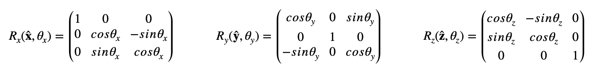
</p>


with $\pmb{\hat{x}},\pmb{\hat{y}},\pmb{\hat{z}}$ being the axes of the rotation and $\theta_{x},\theta_{y},\theta_{z}$ the angles of rotation in the different directions.
Other rotation matrices can be obtained from these three using matrix multiplication. 

<p  align="center">
 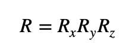
</p>

The order of rotation operations is from right to left; the matrix adjacent to the vector is the first to be applied, in this case along $\pmb{\hat{z}}$, and then the others. Usually, matrix multiplication is not commutative therefore attention must be paid when trying to invert rotations.
The rotated coordinates are obtained via matrix multiplication

<p  align="center">
 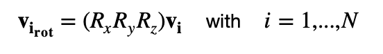
</p>

where $\pmb{v_i}$ is the vector of the coordinates of the $i^{th}$ atom and $N$ is the number of atoms.
In this general case the axis of rotation for each matrix lies on the fixed axis that lies along the respective unit vector $\pmb{\hat{n}}$. In many cases the molecules are not found in the center of the system, meaning that a general rotation along $\pmb{\hat{x}},\pmb{\hat{y}}$ and $\pmb{\hat{z}}$ also causes a displacement of the molecule. To rotate free molecules it is necessary to define the axis of rotation of each molecule and perform the rotationa along that axis. This process requires a thorough analysis of the molecular geometry and it is hard to generalize. Therefore, it is possible to perform a fictitious rotation along the central axis of the molecule just by generally rotating the molecule along the $x$, $y$ and $z$ axes of the system and then relocating it in its original position by

<p  align="center">
 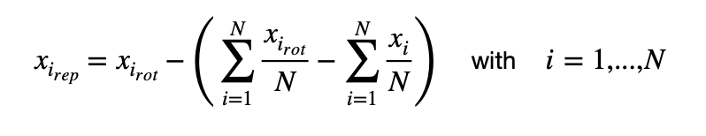
</p>

where $x_{i_{rep}}$, $x_{i_{rot}}$ and $x_{i}$ are the new, rotated and original $x$ coordinate of the $i^{th}$ atom, respectively. The same also applies to the $y$ and $z$ coordinates.


### Translations

To perform translations the process is straightforward. The translated coordinates can be found by simply adding the wanted amount to the preexisting coordinates

<p  align="center">
 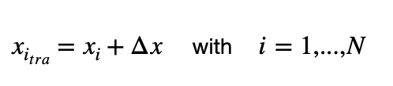
</p>

where $x_{i_{tra}}$ and $x_{i}$ are the new and original $x$ coordinate of the $i^{th}$ atom, respectively and $N$ is the number of atoms. The same also applies to the $y$ and $z$ coordinates.

### Cloning and Supercell

The system can be easily cloned or replicated along each direction by defining a supercell. This is very useful in system containing bulks or surfaces, whose crystal structure can be described by means of a unit cell [[2]](#2). The unit cell is a repeating unit formed by the vectors spanning the points of a lattice. For the same system multiple unit cells can be defined and a larger system can be obtained just by replicating the unit cell for the wanted amount.
Any three-dimensional supercell can be defined via three cell vectors $a$, $b$ and $c$ and three cell angles $\alpha$, $\beta$ and $\gamma$. Via different values of cell vectors and angles all conventional primitive cells can be derived

<p  align="center">
 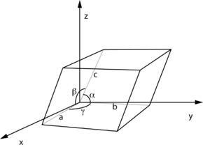
</p>

The supercell can be represented in matrix form

<p  align="center">
 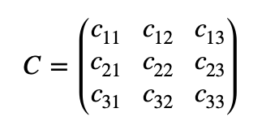
</p>


where $(c_{11}, c_{12}, c_{13})$, $(c_{21}, c_{22}, c_{23})$ and $(c_{31}, c_{32}, c_{33})$ are the $x$, $y$ and $z$ components of the cell. In the case of an orthorombic cell the matrix is simply

<p  align="center">
 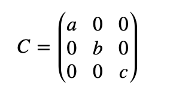
</p>

Instead for a triclinic cell

<p  align="center">
 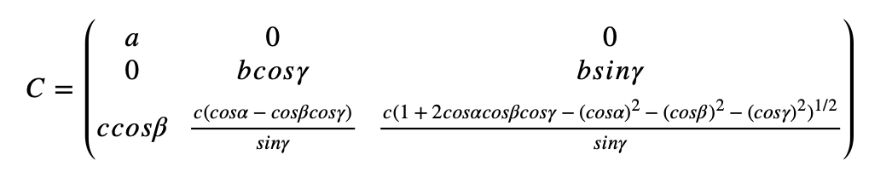
</p>


From here, the cloning values can be constructed 

<p  align="center">
 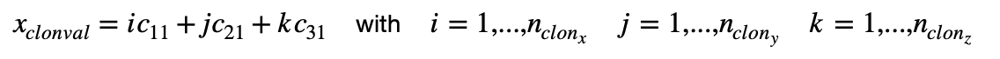
</p>

where $n_{clon_{x}}, n_{clon_{y}}, n_{clon_{z}}$ are the cloning factors in the $x$, $y$ and $z$ directions. Then the atomic coordinates can be replicated to clone the entire system

<p  align="center">
 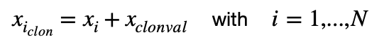
</p>

where $x_{i_{rep}}$ and $x_{i}$ are the new and original $x$  coordinate of the $i^{th}$ atom, respectively and N is the number of atoms. 


## Tutorial

This tutorial will show how <tt>roto-trasla.py</tt> can be used to generate a graphite surface and a CO<sub>2</sub> molecule can be placed on it. All the files required to perform this tutorial can be found in the [tutorial/](https://github.com/chiara-corsini7/programming/tree/main/project/roto-trasla/tutorial) repository.

### Creating the graphite surface

Graphite is a crystalline form of the element carbon which consists of stacked layers of graphene. Graphene can be represented via a hexagonal supercell and two non equivalent carbon atoms **A** and **B** as shown in the following picture.

<p  align="center">
 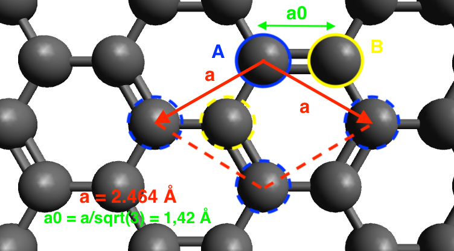
</p>

Since we will be considering as a repeating unit an hexagonal cell, to correctly replicate the coordinates of the atoms they have to be expressed in "hexagonal coordinates". The atoms will be positioned in <tt>A = (0., 0., 0.)</tt> and <tt>B = (a<sub>0</sub>(√3/2), a<sub>0</sub>/2, 0.) = (a/2, a/2√3, 0.)</tt>, as expressed in graphene.xyz. The cell will be defined by the following cell vectors and angles

- <tt>a = a, b = a, c = 10 Å</tt>
- <tt>α = 90°, β = 90°, γ = 120°</tt>

where a is the cell parameter and it is <tt>a = 2.464 Å</tt>. By replicating the coordinates in the $x$ and $y$ direction of the wanted amount we will obtain a graphene sheet. 

To create graphite, we have to shift that same graphene sheet by  <tt>dx = a/2, dy = a(√3/6), dz = 3.34 Å</tt> and unite it to the previous graphene sheet. Doing this we will have obtained a 2 layer graphite surface.


To start creating the graphene layer make sure to be in the roto-trasla/ directory

```bash
cd programming/project/roto-trasla
```

Then it is time to replicate the graphene.xyz file to make a 3 x 3 graphene layer by typing

```bash
python roto-trasla.py tutorial/graphene.xyz -v 2.464 2.464 10. -a 90. 90. 120. -c 3 3 1 
```
The cloned coordinates will be printed on screen and can be copied and pasted into a new file through vim. Do not forget to include the number of atoms to build the new <i>.xyz</i> file.

```bash
vi tutorial/first-layer.xyz
```
This file can be translated to create the second layer of graphene that will make up the graphite surface

```bash
python roto-trasla.py tutorial/first-layer.xyz -t 1.232 0.71 3.34
```
The translated coordinates can be copied and pasted into a new file

```bash
vi tutorial/graphite.xyz
```
The coordinates of the carbon atom of the first layer, contained in the file <tt>tutorial/first-layer.xyz</tt>, can be copied after printing them on the bash

```bash
cat tutorial/first-layer.xyz
```

and pasted at the end of the file <tt>tutorial/graphite.xyz</tt> using any text editor. Remember to also modify the number of atoms at the beginning of the <i>.xyz</i> file from 18 to 36. Using vim

```bash
vi tutorial/graphite.xyz
```

after this is done the system can be visualized by using any molecule visualizer (Avogadro, XCrySDen, VMD ...), or just by typing

```bash
python roto-trasla.py tutorial/graphite.xyz -v 7.392 7.392 10. -a 90. 90. 120. -i
```
by opening the file <tt>tutorial/graphite.png</tt> you will see

<p  align="center">
 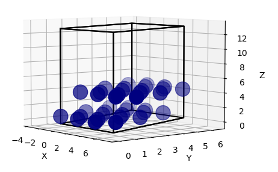
</p>

The graphite surface is constructed!

### Positioning the CO<sub>2</sub> molecule

CO<sub>2</sub> is a linear molecule composed by two atoms of oxygen connected by a central carbon atom. The C--O distance is of <tt>1.16 Å</tt>, making the <i>.xyz</i> file very easy, as shown in <tt>CO2.xyz</tt>. To position the molecule with the carbon atom on top of one of the carbon atoms of graphene and the oxygen atoms along the diagonal of the hexagonal cell it has to be translated by <tt>dx = 2.464 Å, dy = 2.843887 Å, dz = 6.5 Å</tt> and rotated by 30° along z respect to its molecular axis. 

This is easily done by tiping

```bash
python roto-trasla.py tutorial/CO2.xyz -t 2.464 2.843887 6.5 -r 0. 0. 30.
```

we can construct the final file by copying the roto-translated coordinates of CO<sub>2</sub> from the bash into a new file 

```bash
cp tutorial/graphite.xyz tutorial/graphite+CO2.xyz
```
and pasting them at the end of the file <tt>tutorial/graphite+CO2.xyz</tt> with any text editor, reminding to change the atom number at the beginning of the file from 36 to 39. Using vim 

```bash
vi tutorial/graphite+CO2.xyz
```
The system can be visualized by using any molecule visualizer (Avogadro, XCrySDen, VMD ...), or just by typing

```bash
python roto-trasla.py tutorial/graphite+CO2.xyz -v 7.392 7.392 10. -a 90. 90. 120. -i
```
and opening the image <tt>tutorial/graphite+CO2.png</tt> you will see

<p  align="center">
 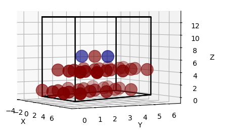
</p>

The system is set!

# References

<a id="1">[1]</a> 
Heard, W. B. (2006). Rigid body mechanics: Mathematics, physics and applications. Weinheim: Wiley-VCH. 


<a id="2">[2]</a> 
Ashcroft, N. W., Mermin, N. D. (1976). Solid State Physics. Holt-Saunders.

